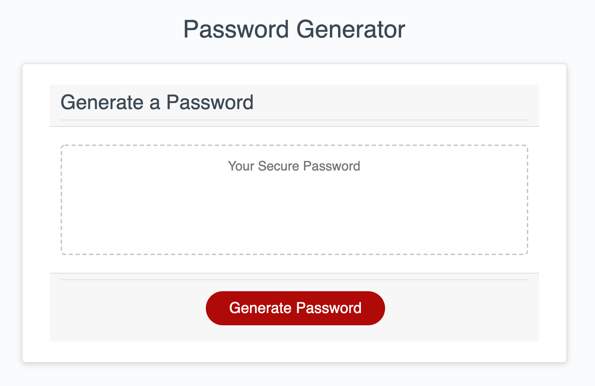
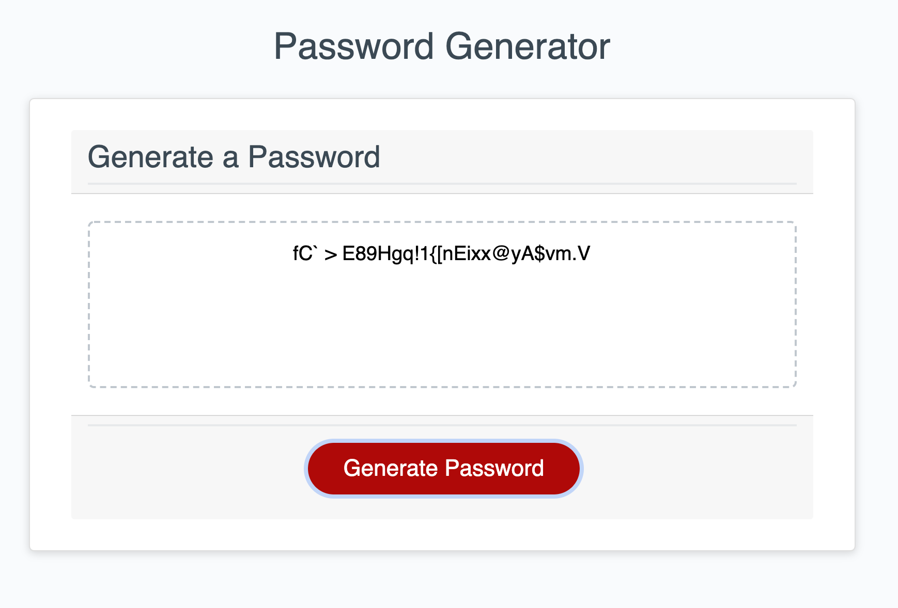

# 🌸 welcome to my password generator! 🌸

here's a random password generator developed as part of the UC Berkeley Full Stack Development bootcamp curriculum.

in this assignment, i was tasked with:

🍓 creating a function to generate a random password between 8 and 128 characters in length
🍓 prompting options to include special, numerical, uppercase, and lowercase characters
🍓 operationalizing the generate password button with html and javascript so that it creates and displays the random password as text on the page

here are some screenshots of my work: 

you can view the deployed application here: <a href=“https://descardi-b.github.io/password-generator/“>https://descardi-b.github.io/password-generator</a>
